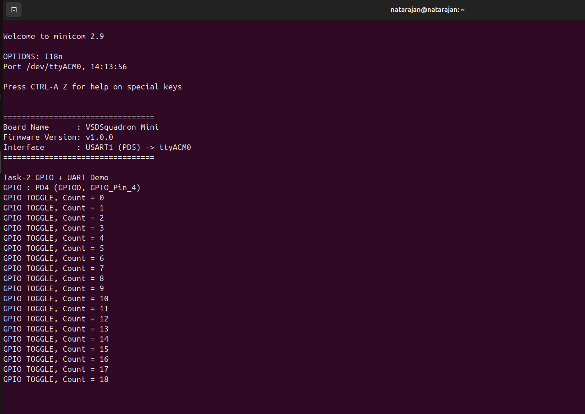

---
# Task-2 Hardware Execution Evidence

## 1. UART Evidence
- Screenshot showing 10+ consecutive UART lines

- Video recording of reset and live UART output

## 2. GPIO Evidence
- PD4 pin highlighted
- Short video showing LED/probe toggling

### GPIO Mapping
- Physical Pin Label: PD4
- Firmware GPIO Number: GPIOD, GPIO_Pin_4

## 3. Verification Method
GPIO toggling was verified using a visible LED/probe signal
synchronized with UART counter messages.

### UART Screenshot

### UART Video
- ./vedios/Uart_Vedio.mp4

### GPIO Video
- ./vedios/GPIO_vedio.mp4

