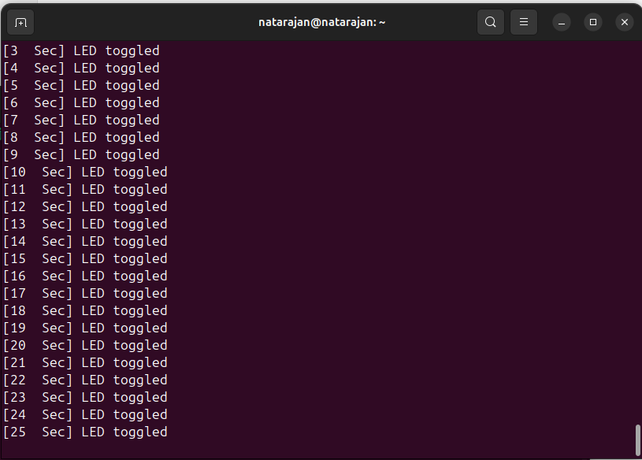

# Task-3 Evidence: Timer Library + Demo Application

---

## 1. UART Evidence

### UART Output Screenshot / Photo

- The following UART logs were captured from the running application.  
- The logs include **timestamps (timer ticks in seconds)** to prove correct timer operation.

---

## 2. Hardware Evidence

### Board and Output Verification
- ./video/HW_video.mp4
- ./video/serial.mp4

The evidence shows:
- VSDSquadron Mini RISC-V board
- On-board LED toggling every 1 second
- LED behavior synchronized with UART log timestamps

The board and output signal are clearly visible in the attached media.

---

## 3. Explanation

### How the Application Uses the Library
- The application initializes UART, GPIO, and Timer using library APIs
- The timer library is configured with a 1 ms system tick
- A periodic timer callback is registered using `timer_start_periodic()`
- The callback toggles the LED using the GPIO library
- Timestamped logs are printed using the UART library
- The application code does not access any hardware registers directly

### What Was Verified on Hardware
- Timer interrupt triggers at the configured interval
- LED toggles precisely every 1 second
- UART logs display correct and monotonic timestamps
- Application runs continuously on real hardware without errors

This confirms correct separation of application logic and peripheral driver libraries, as required by Task-3.

