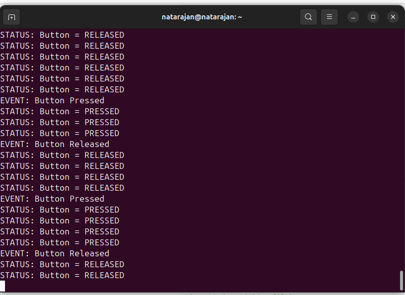

## 1. UART Logs

## 2. Hardware Proof 
- ./vedio/RTOS_task4.mp4
- ./vedio/RTOS_screen_only.mp4
---

## 3. Verification Notes

### What was tested
- Scheduler task registration
- Timer interrupt (1 ms tick)
- LED toggling via GPIO
- UART message printing
- Button input detection

### What worked
- All three tasks executed concurrently
- LED blink timing was stable
- UART output matched button state
- No blocking delays were used

### Limitations
- Cooperative scheduling (no preemption)
- No task priorities
- Button pin differs across board revisions
- No dynamic memory management

---

## Conclusion
The Mini-RTOS successfully demonstrates a basic real-time multitasking system using a cooperative scheduler with hardware timer support. The system is deterministic, efficient, and suitable for understanding core RTOS concepts.

